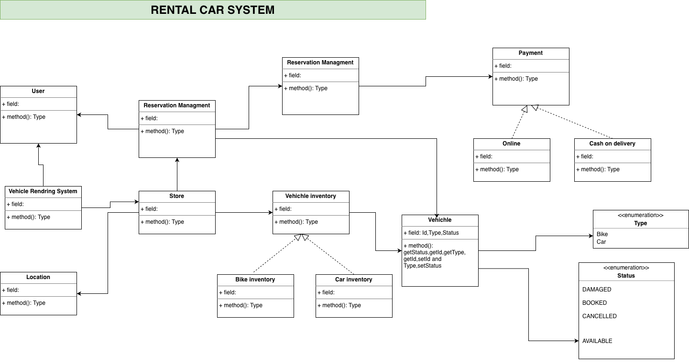

# Vehicle Rental System 🚗🏍️

A simple low-level design implementation of a **Vehicle Rental System** using Java.
This project demonstrates clean object-oriented design, separation of concerns,
and extensibility using interfaces and factory patterns.

---

## 📌 Features
- Multiple stores
- Multiple vehicle types (Bike, Car)
- Inventory management
- Reservation-based booking
- Availability derived from active reservations
- Extensible design (add Cycle, Truck easily)

---

## 🧩 System Design Diagram

## 🏗️ Project Structure

