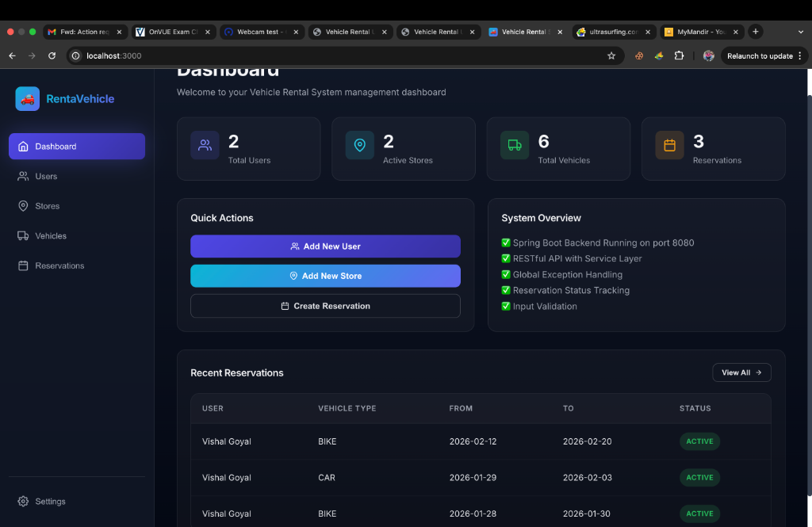
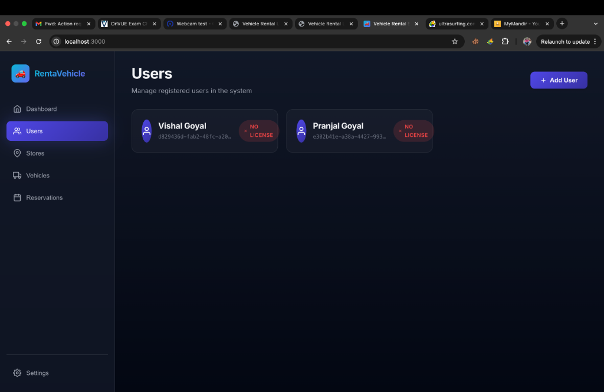
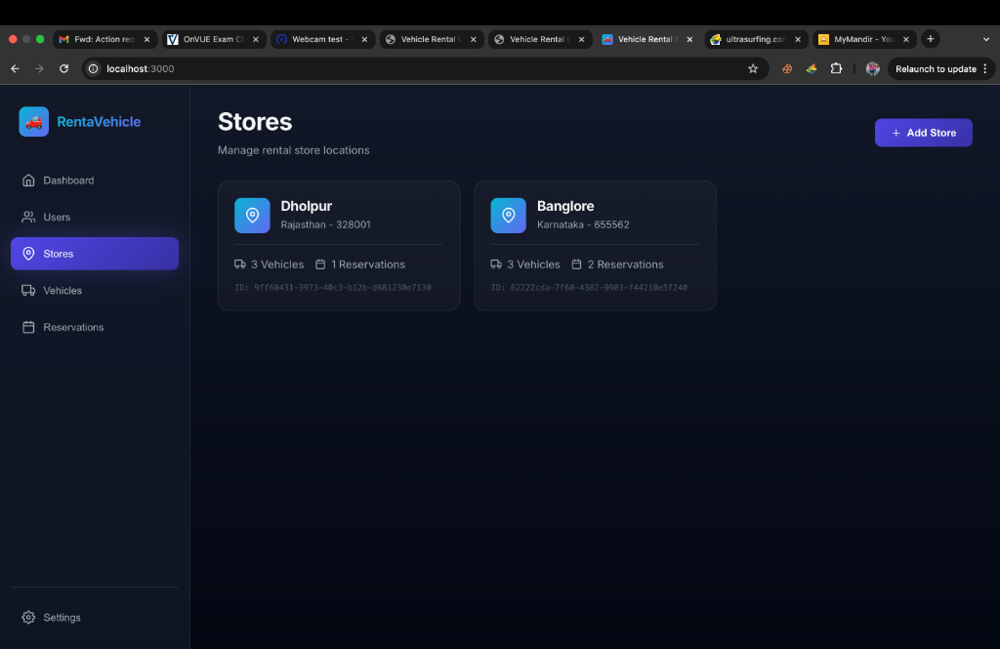
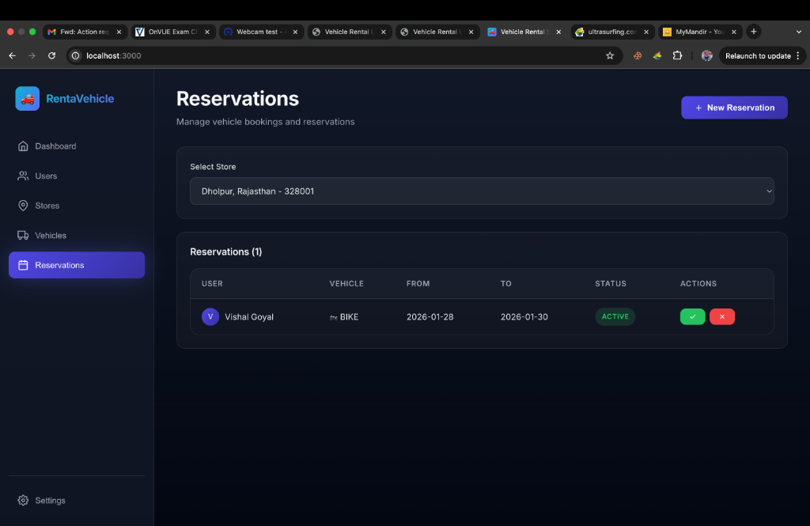

# 🚗 Vehicle Rental System

A full-stack **Vehicle Rental Management System** built with **Spring Boot** (backend) and **React.js** (frontend). This project demonstrates modern software engineering practices including RESTful API design, service layer architecture, and a premium dark-themed UI.

[](https://www.oracle.com/java/)
[](https://spring.io/projects/spring-boot)
[](https://reactjs.org/)
[](https://vitejs.dev/)

---

## 📋 Table of Contents

- [Features](#-features)
- [Tech Stack](#-tech-stack)
- [Architecture](#-architecture)
- [Prerequisites](#-prerequisites)
- [Installation & Setup](#-installation--setup)
- [Running the Application](#-running-the-application)
- [API Documentation](#-api-documentation)
- [Project Structure](#-project-structure)
- [Design Patterns](#-design-patterns)
- [Screenshots](#-screenshots)

---

## ✨ Features

### Backend (Spring Boot)
- ✅ **RESTful API** with proper HTTP methods and status codes
- ✅ **Service Layer Architecture** for separation of concerns
- ✅ **Global Exception Handling** with `@ControllerAdvice`
- ✅ **Input Validation** and business logic validation
- ✅ **Reservation Status Management** (ACTIVE, COMPLETED, CANCELLED)
- ✅ **Dynamic Availability Checking** based on active reservations
- ✅ **Factory Pattern** for inventory management
- ✅ **UUID-based** entity identification

### Frontend (React.js)
- ✅ **Modern Dark Theme** with glassmorphism effects
- ✅ **Responsive Design** for all screen sizes
- ✅ **Real-time Updates** with React hooks
- ✅ **Toast Notifications** for user feedback
- ✅ **Modal-based Forms** for data entry
- ✅ **Dashboard** with statistics and quick actions
- ✅ **CRUD Operations** for Users, Stores, Vehicles, and Reservations

---

## 🛠️ Tech Stack

### Backend
| Technology | Purpose |
|------------|---------|
| **Java 17** | Programming language |
| **Spring Boot 3.2.1** | Backend framework |
| **Spring Web** | RESTful web services |
| **Jackson** | JSON serialization |
| **Maven** | Build tool & dependency management |

### Frontend
| Technology | Purpose |
|------------|---------|
| **React 18** | UI library |
| **Vite 5** | Build tool & dev server |
| **Axios** | HTTP client |
| **React Icons** | Icon library |
| **React Hot Toast** | Toast notifications |

---

## 🏗️ Architecture

```
┌─────────────────┐
│   React UI      │  ← Frontend (Port 3000)
│  (Vite + React) │
└────────┬────────┘
         │ HTTP/REST
         ↓
┌─────────────────┐
│  Controllers    │  ← REST Endpoints
├─────────────────┤
│  Services       │  ← Business Logic
├─────────────────┤
│  Models         │  ← Domain Entities
└─────────────────┘
    Spring Boot (Port 8080)
```

### Design Patterns Used
1. **Service Layer Pattern** - Business logic separation
2. **Factory Pattern** - `InventoryFactory` for vehicle inventory creation
3. **Strategy Pattern** - `VehicleInventory` interface with multiple implementations
4. **DTO Pattern** - Java Records for request/response objects
5. **Singleton Pattern** - Spring beans managed by IoC container

---

## 📦 Prerequisites

Before running this project, ensure you have the following installed:

- **Java 17 or higher** - [Download](https://www.oracle.com/java/technologies/downloads/)
- **Maven 3.6+** - [Download](https://maven.apache.org/download.cgi)
- **Node.js 18+** - [Download](https://nodejs.org/)
- **npm or yarn** - Comes with Node.js

### Verify Installation

```bash
java -version    # Should show Java 17+
mvn -version     # Should show Maven 3.6+
node -version    # Should show Node 18+
npm -version     # Should show npm 8+
```

---

## 🚀 Installation & Setup

### 1. Clone the Repository

```bash
git clone https://github.com/YOUR_USERNAME/Vehicle-Rental-System.git
cd Vehicle-Rental-System
```

### 2. Backend Setup

```bash
cd rental
mvn clean install
```

This will:
- Download all dependencies
- Compile the Java code with `-parameters` flag
- Run tests (if any)
- Package the application

### 3. Frontend Setup

```bash
cd ../frontend
npm install
```

This will install all React dependencies.

---

## ▶️ Running the Application

### Option 1: Run Both Services Separately (Recommended for Development)

**Terminal 1 - Start Backend:**
```bash
cd rental
mvn spring-boot:run
```

The backend will start on **http://localhost:8080**

**Terminal 2 - Start Frontend:**
```bash
cd frontend
npm run dev
```

The frontend will start on **http://localhost:3000**

### Option 2: Production Build

**Backend:**
```bash
cd rental
mvn clean package
java -jar target/rental-1.0.0.jar
```

**Frontend:**
```bash
cd frontend
npm run build
npm run preview
```

---

## 📡 API Documentation

### Base URL
```
http://localhost:8080/api
```

### Endpoints

#### Users
| Method | Endpoint | Description |
|--------|----------|-------------|
| `GET` | `/users` | Get all users |
| `POST` | `/users` | Create a new user |

**Example Request:**
```json
POST /api/users
{
  "name": "John Doe",
  "drivingLicence": true
}
```

#### Stores
| Method | Endpoint | Description |
|--------|----------|-------------|
| `GET` | `/stores` | Get all stores |
| `POST` | `/stores` | Create a new store |

**Example Request:**
```json
POST /api/stores
{
  "state": "Karnataka",
  "district": "Bangalore",
  "pincode": "560001"
}
```

#### Vehicles
| Method | Endpoint | Description |
|--------|----------|-------------|
| `POST` | `/vehicles/{storeId}` | Add vehicle to a store |
| `GET` | `/vehicles/{storeId}` | Get all vehicles in a store |
| `GET` | `/vehicles/available/{storeId}` | Get available vehicles |

**Example Request:**
```json
POST /api/vehicles/{storeId}
{
  "type": "BIKE",
  "status": "ACTIVE"
}
```

#### Reservations
| Method | Endpoint | Description |
|--------|----------|-------------|
| `POST` | `/reservations` | Create a reservation |
| `GET` | `/reservations/store/{storeId}` | Get reservations by store |
| `GET` | `/reservations/user/{userId}` | Get reservations by user |
| `PUT` | `/reservations/{storeId}/{reservationId}/cancel` | Cancel a reservation |
| `PUT` | `/reservations/{storeId}/{reservationId}/complete` | Complete a reservation |

**Example Request:**
```json
POST /api/reservations
{
  "storeId": "uuid-here",
  "userId": "uuid-here",
  "vehicleId": "uuid-here",
  "fromDate": "2026-01-25",
  "toDate": "2026-01-27"
}
```

---

## 📂 Project Structure

```
Vehicle-Rental-System/
├── rental/                          # Backend (Spring Boot)
│   ├── src/main/java/vehiclerentalsystem/
│   │   ├── MainApplication.java     # Entry point
│   │   ├── config/                  # Configuration classes
│   │   ├── controller/              # REST Controllers
│   │   ├── services/                # Business logic layer
│   │   ├── model/                   # Domain entities
│   │   ├── inventory/               # Inventory management
│   │   ├── enums/                   # Enumerations
│   │   └── exception/               # Exception handling
│   └── pom.xml                      # Maven dependencies
│
├── frontend/                        # Frontend (React + Vite)
│   ├── src/
│   │   ├── components/              # Reusable components
│   │   ├── pages/                   # Page components
│   │   ├── services/                # API service layer
│   │   ├── App.jsx                  # Main app component
│   │   └── index.css                # Global styles
│   ├── package.json                 # npm dependencies
│   └── vite.config.js               # Vite configuration
│
└── README.md                        # This file
```

---

## 🎨 Key Implementation Details

### Backend Highlights

1. **Service Layer Pattern**
   - Controllers delegate to services
   - Services contain business logic
   - Clean separation of concerns

2. **Global Exception Handling**
   ```java
   @ControllerAdvice
   public class GlobalExceptionHandler {
       @ExceptionHandler(NoSuchElementException.class)
       public ResponseEntity<Map<String, Object>> handleNotFound(...)
   }
   ```

3. **Reservation Status Lifecycle**
   - `ACTIVE` → `COMPLETED` or `CANCELLED`
   - Only active reservations block vehicle availability

4. **Dynamic Availability**
   - Vehicles are available if:
     - Status is `ACTIVE`
     - Not in any active reservation

### Frontend Highlights

1. **Premium Dark Theme**
   - CSS variables for consistent theming
   - Glassmorphism effects
   - Smooth animations and transitions

2. **State Management**
   - React hooks (`useState`, `useEffect`)
   - Real-time data fetching
   - Optimistic UI updates

3. **API Integration**
   - Axios service layer
   - Centralized API configuration
   - Error handling with toast notifications

---

## 🎯 Business Logic

### Reservation Validation
- ✅ User must have a valid driving license
- ✅ From date cannot be in the past
- ✅ From date must be before to date
- ✅ Vehicle must be available for the selected dates

### Availability Logic
A vehicle is considered **available** if:
1. Vehicle status is `ACTIVE` (not in maintenance)
2. Vehicle is not part of any `ACTIVE` reservation

---

## 🧪 Testing the Application

### Manual Testing Flow

1. **Create a Store**
   - Navigate to "Stores" page
   - Click "Add Store"
   - Fill in location details

2. **Add Vehicles**
   - Navigate to "Vehicles" page
   - Select a store
   - Add bikes and cars

3. **Create a User**
   - Navigate to "Users" page
   - Click "Add User"
   - Ensure "Has Valid Driving License" is checked

4. **Make a Reservation**
   - Navigate to "Reservations" page
   - Click "New Reservation"
   - Select user, vehicle, and dates
   - Submit

5. **Manage Reservations**
   - View active reservations
   - Complete or cancel as needed

---

## 🐛 Troubleshooting

### Backend Issues

**Port 8080 already in use:**
```bash
# Find and kill the process
lsof -ti:8080 | xargs kill -9
```

**Maven not found:**
```bash
# Install via Homebrew (macOS)
brew install maven

# Or use the Maven wrapper (if available)
./mvnw spring-boot:run
```

### Frontend Issues

**npm install fails:**
```bash
# Clear npm cache
npm cache clean --force
npm install
```

**Port 3000 already in use:**
- Vite will automatically try the next available port (3001, 3002, etc.)

---

## 📝 Future Enhancements

- [ ] Add database persistence (PostgreSQL/MySQL)
- [ ] Implement user authentication & authorization
- [ ] Add payment integration
- [ ] Email notifications for reservations
- [ ] Advanced search and filtering
- [ ] Vehicle damage reporting
- [ ] Analytics dashboard
- [ ] Mobile app (React Native)

---

## 👨‍💻 Author

**Your Name**
- GitHub: [@YOUR_USERNAME](https://github.com/YOUR_USERNAME)
- LinkedIn: [Your LinkedIn](https://linkedin.com/in/YOUR_PROFILE)
- Email: your.email@example.com

---

## 📄 License

This project is open source and available under the [MIT License](LICENSE).

---

## 🙏 Acknowledgments

- Spring Boot documentation
- React.js community
- Design inspiration from modern SaaS applications

---

## 📸 Screenshots

### Dashboard
The main dashboard showing system statistics, quick actions, and recent reservations.


### Users Management
Manage registered users with driving license status tracking.


### Store Locations
View and manage multiple rental store locations with vehicle and reservation counts.


### Reservations
Create, view, and manage vehicle reservations with status tracking.


---

**⭐ If you found this project helpful, please consider giving it a star!**
